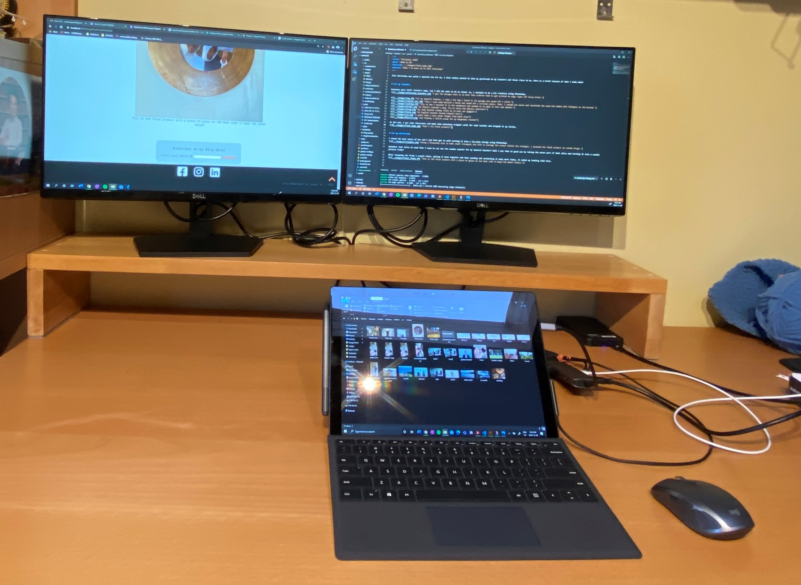

This Christmas was quite a special one for me. I also really wanted to show my gratitude to my teachers and those close to me. Here is a brief recount of what I made made!

# For my Teachers

Everyone gets their teachers mugs, but I did not want to be as bland. So, I decided to be a bit creative using Photoshop.

In the end, I put some chocolates and made some miniature origami cards for each teacher and wrapped it up nicely.

# For my Girlfriend

I found the best photo of her and I and then got to work turning it into a low-poly design using Photoshop.

Remember that slice of wood that I used to cut out the wooden coaster for my Spanish teacher? Well I put that to good use by taking the outer part of that slice and turning it into a wooden picture frame!

After dropping the frame a couple times, gluing it back together and then sanding and varnishing it many more times, it ended up looking like this.

# For My Mom

I found a nice picture of my mom, made it black and white, then put it through an online image processor that split up the different shades of colour into different regions. Then, my sister used an embroidery hoop and somehow crocheted on different colours until it looked like my mom:

<iframe class="center" width="100%" height="500" src="https://www.youtube.com/embed/Dqj_CtumLv8" frameborder="0" allow="accelerometer; autoplay; clipboard-write; encrypted-media; gyroscope; picture-in-picture" allowfullscreen></iframe>

Take a look at <a href="https://www.tiffanymatthe.com" target="blank">my sister's wesbite</a>.

# What I got!

Now for the most exciting part. This year, I got...

Anyhow, that is how my Christmas went. Let me know how yours was by emailing me: <a href="mailto:matthejasper@gmail.com" target="blank">matthejasper@gmail.com</a>

P.S. stay tuned for some posts I promised to make a while back! Consider subscribing to my blog using the box below :)
