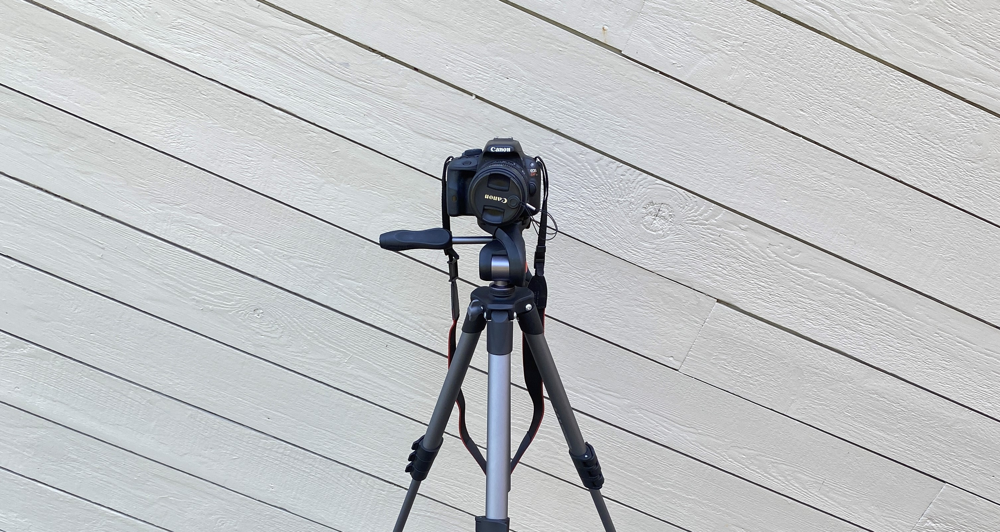
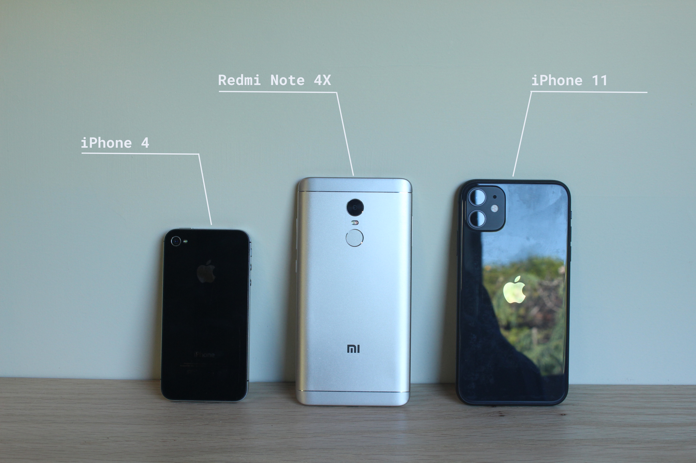
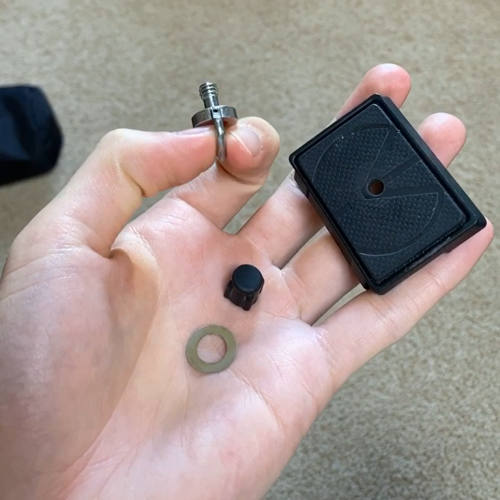
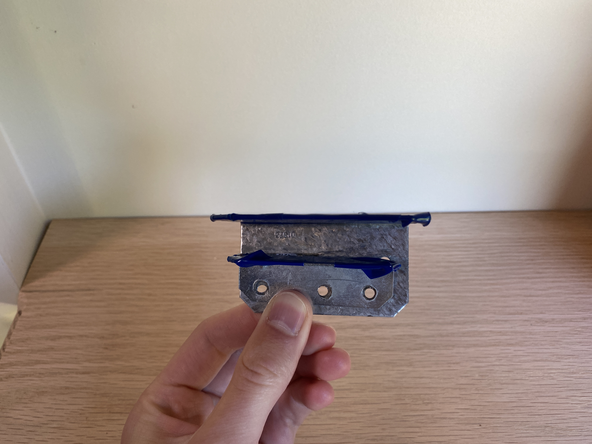
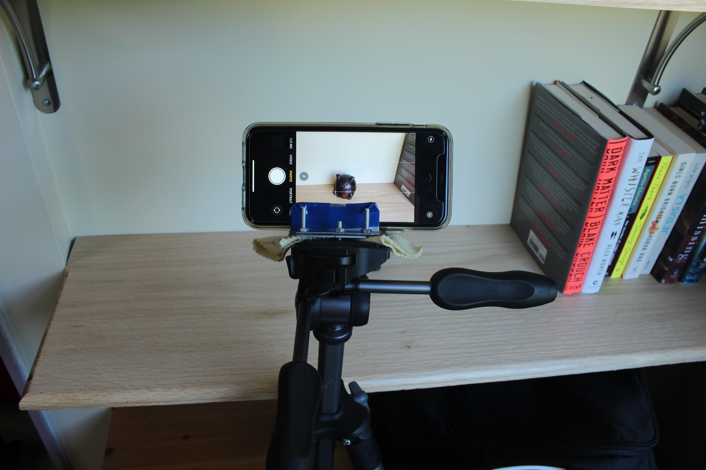
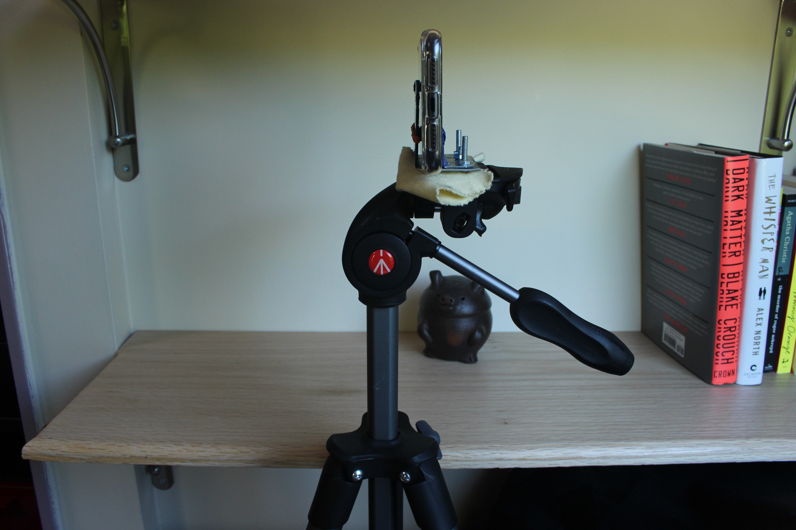
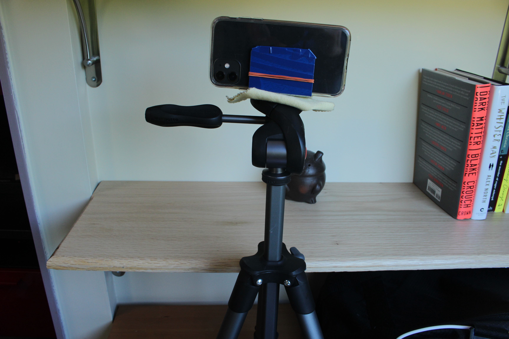

# Camera Stands
Camera stands. So simple, yet so useful. Since my sister got her camera back in December of 2014, our Manfrotto camera stand has been so very useful. From school theatre class projects, to food photography to family photos (minus having to balance one's device precariously on a ledge that would lead to the device's destruction if even a slight breeze were to tip it over), the camera stand has become an indispensable asset when it comes to photography.

*Manfrotto Camera Stand and Canon EOS Kiss X7 [taken on iPhone 11]*

# New Camera
I'm seventeen and I've only had three different phones in my life:
- Apple iPhone 4 (2014-2016)
- Xiaomi Redmi 4X (2016-2020)
- Apple iPhone 11 (2020-Present)

I'll tell you what. My iPhone 4 took better photos than my Redmi 4X. That really annoyed me. All I ever wanted to do was take qualilty photos and videos of all my vacations around the world. Instead, I was left with a cheap Chinese phone my dad insisted was amazing. It took horrendous photos.

I only got my AMAZING iPhone 11 😍 in June of this year. I was going to take so many amazing photos and videos of my July trip to Colombia, but, of course, <strong>CORONAVIRUS</strong> ruined those plans.

# How Coronavirus Changed my Summer Plans
Instead of heading over to South America for a few weeks, my dad took me to Murtle Lake in Wells Gray Provincial Park, British Columbia for a six-day canoe trip.

Of course, I wanted to document every part of this trip because, from what I heard, the views were amazing.

Stay tuned for a recap video on that adventure.

# DIY Camera Stand Phone Adapter
<strong>Now comes the fun part!</strong>

Instead of bringing my sister's heavy camera, I wanted to bring my iPhone to take photos. I also wanted to take timelapse videos, thus my phone was necessary.

## What you'll need

*You can put electrical tape around the metal brackets to protect your phone*

1. <strong>Remove camera stand camera adapter</strong>

    This is what attaches to the camera. I wil be modifying it to fit my phone.</ul>

2. <strong>Remove screw from camera adapter</strong>

    I'll be using the hole that the screw is meant to go in to fit my very own extension to the adapter.
    
    *Taking screw off*

3. <strong>Drillll!!!</strong>

    - Put the back of your phone against the large L-bracket and slide the smaller one along the base of the larger bracket until it touches the screen.
    - Allow for a fit that does not refrain the phone from sliding in and out the two brackets.
    - Mark the position of the small bracket.
    - Drill three holes through the small bracket - one in the center, and one on either side of the center hole about 3cm apart.
4. <strong>Dril again</strong>

    - Put the small bracket back into its position.
    - Using a Sharpie, mark the location of the holes you just drilled onto the large bracket.
    - Remove the small bracket and drill the holes you just marked.
    
    *As you can see I had to improvise with the locations of the holes since there were already some mismatched ones on the larger bracket. It still worked though!*
5. <strong>Put it together!</strong>

    - Align the two brackets and put two screws through the side holes, from the bottom upwards.
    - Secure the nuts with the wrench and screwdriver.
    - Make sure your phone still fits.
      
    - Take one screw, put it through the washer and then though the bottom of the camera stand adapter, so that the washer pushes against the surface of the adapter.
    - <h4><strong>!!!IMPORTANT!!! To protect the camera stand adapter from the head of the screws, take something soft (cloth, styrofoam) and put it between the bracket combination and the adapter before securing them together.</strong></h4>
    - The screw should protrude through the adpater and you should be able to insert it through the bracket combination's center hole.
    - Take the nut and secure the center screw.

    
    *View from photographer's point of view*

    
    *View from side*

    
    *View from back*

6. <strong>Start using your camera stand and phone!</strong>
